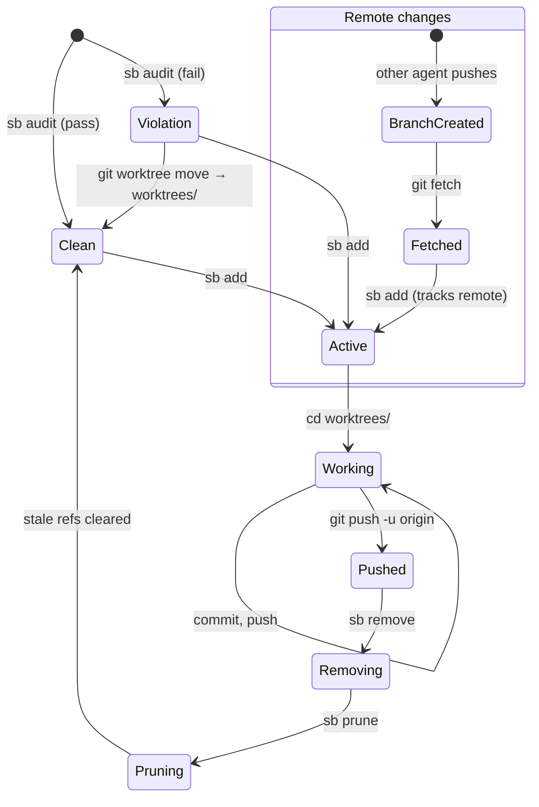

# sb

Worktree management for agents.

Agents can't remember conventions. Telling an agent "put worktrees
under `worktrees/`, not as siblings" works once, maybe. Telling it
again next session doesn't scale. So instead of explaining the rule,
you give it a tool that enforces the rule.

`sb add foo` does the right thing. `sb audit` catches when something
didn't. That's the whole idea: swap instructions for tools.

## Install

```sh
ghq get jwalsh/sb
cd $(ghq root)/github.com/jwalsh/sb
make install              # macOS / Linux
GO=go124 gmake install    # FreeBSD
```

Installs to `~/.local/bin`, not `~/go/bin`.

## Commands

```
sb audit              Exit non-zero if any worktree is outside worktrees/
sb add <name> [branch] Create worktree at worktrees/<name>
sb list               Show all worktrees with placement status
sb remove <name>      Remove a worktree (--force for dirty trees)
sb prune              Clean up stale worktree refs
sb restart --force    Remove all worktrees, prune, re-init
sb quickstart         Agent-consumable setup context
sb version            Print version
```

## How add works

`sb add foo` creates `worktrees/foo` on branch `feat/foo`. If
`origin/feat/foo` exists, it tracks that. If a local `feat/foo` exists,
it checks that out. Otherwise it creates the branch from HEAD.

The `worktrees/` directory is created on first use and added to
`.gitignore` automatically.

## Worktree lifecycle



A single agent's workflow is linear: add, work, push, remove, prune.
The distributed case is where it gets interesting — other agents on
other machines push branches, and your local state goes stale. After
a fetch, new remote branches can be materialized as worktrees, and
deleted branches leave stale refs that `sb prune` cleans up.

```sh
sb audit                  # verify clean state
sb add PROJ-a1b2          # isolated working directory
cd worktrees/PROJ-a1b2
# ... work, commit, push ...
sb remove PROJ-a1b2
sb prune
```

Agents discover each other's in-flight work via `git branch -r`.
Worktrees are invisible to git (gitignored) but branches are not.

## Multi-machine sync

If you use `ghq` to manage repos and a sync script (cron, CI, another
machine) that creates worktrees from remote branches, `sb audit`
should pass cleanly as long as the sync follows the `worktrees/`
convention. The typical pattern:

```sh
git fetch --prune origin
for branch in $(git branch -r | grep -v HEAD); do
    safe=$(echo "$branch" | sed 's|origin/||' | tr '/' '-')
    git worktree add "worktrees/$safe" "$branch" 2>/dev/null || true
done
git worktree prune
```

The world changes between audits. Other agents on other machines
complete work, push branches, delete branches. `sb audit` is a
point-in-time check — run it after a fetch to get a current picture.

## Ecosystem

sb is part of a small tooling ecosystem designed for agents.
All tools install to `~/.local/bin` and build with GNU make.

| Tool | Repo | Purpose |
|------|------|---------|
| `bd` | steveyegge/beads | Distributed issue tracking with hash IDs |
| `gt` | steveyegge/gastown | Multi-agent orchestration with rigs |
| `cprr` | jwalsh/cprr | Conjecture-proof-refutation-refinement; worktrees/ gitignored, shell script management layer |
| `sb` | jwalsh/sb | Worktree auditor (this tool) |

## Build

```sh
make build          # local binary
make build-all      # cross-compile (linux, darwin, freebsd)
make test           # run tests
make lint           # go vet + gofmt + golangci-lint
make version-info   # show embedded version
```

Zero external dependencies. Stdlib only.

## License

MIT
